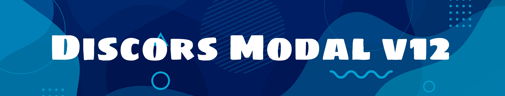

## Install : 
```express-hs
npm i discord-modal-v12
```
* Warning :!!!!!!!!! This Package Working Only in V12

## Define Discord Library Client : 
```js
const Discord = require('discord.js')
const DiscordModal = require('discord-modal-v12')
const client = new Discord.Client()
const modal = new DiscordModal.MessageCollector(client)

client.login('super hero token')
```

## Create New Modal Constrcutor : 

```js
const modal = new DiscordModal.MessageCollector(client)
modal.on('message',message => {
  if(message.content === 'send-button') {
    if(message.author.bot) return
let row = new DiscordModal.ActionRow()
.addComponents(
    new DiscordModal.Button()
    .setStyle(1)
    .setCustomId('shuruhatik')
    .setLabel('click to show modal')

)
message.channel.send(row)
  }
  })

```


## Receive Button Clicks  And Show The Modal : 
```js
modal.on('clickButton',button => {
   let modal  = new DiscordModal.ModalActionRow()
   .setLabel('Hello Welcome Back')
   .setCustomId('modal1')
   .addComponents(
       new DiscordModal.TextInput()
       .setCustomId('1')
       .setStyle('short')
       .setLabel('Your Name : ')
       .setRequired(true)
       .setMax(10)
       .setMin(3),
       new DiscordModal.TextInput()
       .setCustomId('2')
       .setStyle('paragraph')
       .setLabel('About You: ')
       .setRequired(true)
       .setMax(10)
       .setMin(3),

   )
   button.viewModal(modal)
})

```


## Receive Modals Submit : 

```js
modal.on('modalSubmit',modal => {
    const reply1 = modal.getInputValue('1') ///Here TextInput CustomID
    const reply2 = modal.getInputValue('2')///Here TextInput CustomID
    modal.reply({content: `
    hi!
    Your Name  : ${reply1}

    About You : ${reply2}
    `})
})
```


